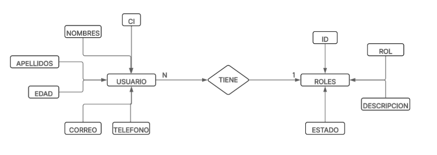
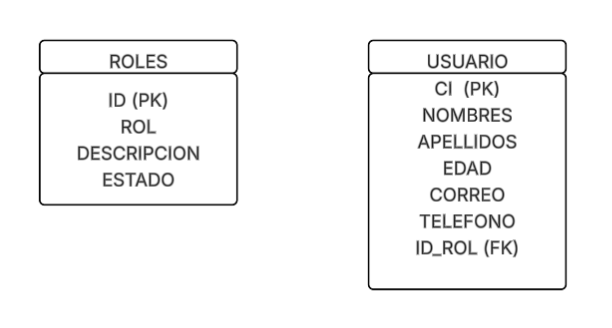

# Panel de Administración de Usuarios y Roles

## Base de Datos

### Modelo Entidad-Relación  


### Modelo Relacional  


---

## Arquitectura del Proyecto

**Ruta principal:** `/PROYECT`

```
/PROYECT
├── contr/
│   ├── createrol.php
│   ├── createuser.php
│   ├── deleterol.php
│   ├── deleteuser.php
│   ├── indexrol.php
│   ├── indexuser.php
│   ├── updaterol.php
│   └── updateuser.php
├── model/
│   ├── conec.php
│   ├── rols.php
│   └── users.php
├── styles/
│   ├── create.css
│   ├── lists.css
│   └── update.css
├── view/
│   ├── form_createrol.php
│   ├── form_createuser.php
│   ├── form_deleterol.php
│   ├── form_deleteuser.php
│   ├── form_updaterol.php
│   ├── form_updateuser.php
│   ├── listrol.php
│   └── listuser.php
├── index.php
├── consul.sql
└── document.md
```

---

## Descripción de Carpetas y Archivos

### `contr/`  
Contiene los archivos de control que gestionan la lógica entre los modelos (`model/`) y las vistas (`view/`).

- **createrol.php:** Crea un nuevo rol.
- **createuser.php:** Crea un nuevo usuario.
- **deleterol.php:** Elimina un rol existente.
- **deleteuser.php:** Elimina un usuario existente.
- **indexrol.php:** Página de inicio que muestra los roles registrados.
- **indexuser.php:** Página de inicio que muestra los usuarios registrados.
- **updaterol.php:** Actualiza la información de un rol.
- **updateuser.php:** Actualiza la información de un usuario.

### `model/`  
Contiene los modelos y funciones que interactúan con la base de datos.

- **conec.php:** Archivo de conexión con la base de datos.
- **rols.php:** Define la lógica y funciones para la gestión de roles.
- **users.php:** Define la lógica y funciones para la gestión de usuarios.

### `styles/`  
Contiene los estilos CSS utilizados en el sistema.

- **create.css:** Estilos para formularios de creación.
- **lists.css:** Estilos para las listas de usuarios y roles.
- **update.css:** Estilos para formularios de actualización.

### `view/`  
Contiene las vistas que el usuario final puede visualizar.

- **form_createrol.php:** Formulario para crear un nuevo rol.
- **form_createuser.php:** Formulario para crear un nuevo usuario.
- **form_deleterol.php:** Formulario para eliminar un rol.
- **form_deleteuser.php:** Formulario para eliminar un usuario.
- **form_updaterol.php:** Formulario para actualizar un rol.
- **form_updateuser.php:** Formulario para actualizar un usuario.
- **listrol.php:** Muestra la lista de roles registrados.
- **listuser.php:** Muestra la lista de usuarios registrados.

### Archivos Principales

- **index.php:** Página de entrada principal del panel de administración.
- **consul.sql:** Script SQL para la creación de la base de datos.
- **document.md:** Documentación del proyecto (este archivo).

## Instrucciones para Ejecutar el Sistema

1. **Crear la base de datos**  
   - Importa el archivo `consul.sql` en tu gestor de base de datos (ej. phpMyAdmin o MySQL Workbench).  
   - Alternativamente, puedes copiar el contenido del archivo y ejecutarlo manualmente en tu motor de base de datos.

2. **Configurar la conexión a la base de datos**  
   - Abre el archivo `model/conec.php`.
   - Cambia los datos de conexión: nombre de usuario, contraseña, nombre de base de datos y puerto, según tu entorno local.

3. **Iniciar el servidor Apache**  
   - Abre XAMPP (u otro servidor local) y activa el módulo Apache.

4. **Abrir el sistema en el navegador**  
   - Dirígete a:  
     `http://localhost/PROYECT/`  
     (Reemplaza `PROYECT` por el nombre real de la carpeta en tu servidor local).
